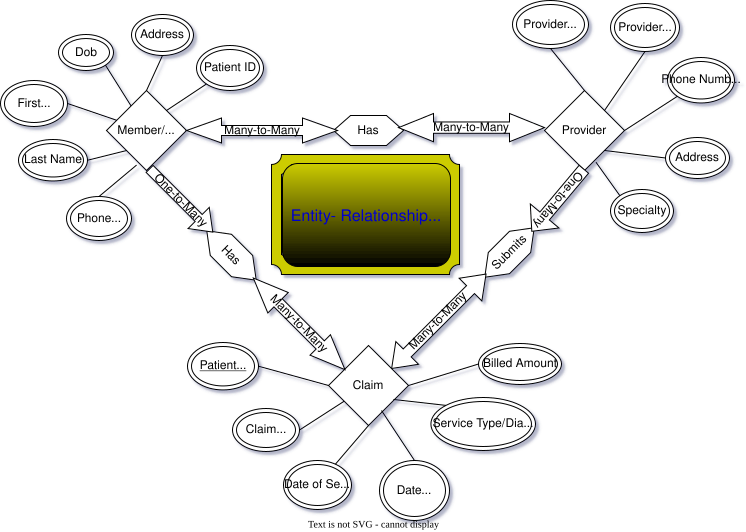

# Medical Claims SQL Portfolio

A small relational database project connecting my medical claims experience with SQL analysis.

## At a glance

- **Focus:** medical claims, provider activity, and data quality.
- **Skills:** table design, primary and foreign keys, joins, aggregation, date grouping, and HAVING filters.
- **Sample:** 5 patients, 5 providers, and 10 claims.
- **Result:** $1,095 in total sample claim amounts; average claim amount of $109.50.

## Start here

[portfolio_analysis.sql](portfolio_analysis.sql) contains the schema, original sample records, and five reporting queries in one file. Run it once in an **empty practice database**. It creates Patients, Providers, and Claims tables.

The complete script was executed against an in-memory SQLite database with foreign keys enabled. It uses broadly portable SQL, but has not been validated on a MySQL or SQL Server instance.

The older [Claims_Database_SQL](Claims_Database_SQL) file is preserved as the original learning exercise.

## Questions answered

| Question | SQL technique | Sample result |
| --- | --- | --- |
| How many claims and what total amount? | COUNT, SUM, AVG | 10 claims; $1,095 total |
| Which providers account for the largest amounts? | LEFT JOIN, GROUP BY, ordering | Provider 5: $375 across 2 claims |
| How do amounts vary by service month? | Date grouping | March: $350 across 2 claims |
| Which members have more than $200 in claims? | JOIN, GROUP BY, HAVING | Members 5, 1, and 4 |
| Are claim relationships missing or amounts invalid? | LEFT JOIN and validation filters | 0 flagged records |

These results describe the sample only. They do not establish trends in real healthcare costs.

## Data model

- **Patients:** one row per patient, identified by PatientID.
- **Providers:** one row per provider, identified by ProviderID.
- **Claims:** each claim links to one patient and one provider.

## Interpretation and limitations

- Amount is a generic claim amount. The data does not distinguish billed, allowed, paid, or member responsibility amounts.
- This is illustrative sample data from the original project, with placeholder addresses and phone numbers.
- Some original service and provider specialty labels are inconsistent. The sample is useful for SQL practice, not clinical or reimbursement conclusions.
- There are no diagnosis codes, enrollment periods, authorization records, or claim statuses. This project does not calculate HEDIS measures or adjudicate claims.
- The validation query checks missing relationships and nonpositive amounts; it is not a complete claims audit.

## About me

I work in healthcare member outreach and have experience in medical claims and customer service. My current work includes NCQA HEDIS reporting, SQL, and helping members navigate care.

- Data Analytics bachelor's degree, expected Spring 2028
- Health Information Management bachelor's degree, expected Spring 2029
- [LinkedIn](https://www.linkedin.com/in/steve-nicolai-455664218/)

## Project development

The original schema and sample data are retained. The documented reporting script and README were developed with AI assistance in September 2026; the reported query results were checked by executing the script.
